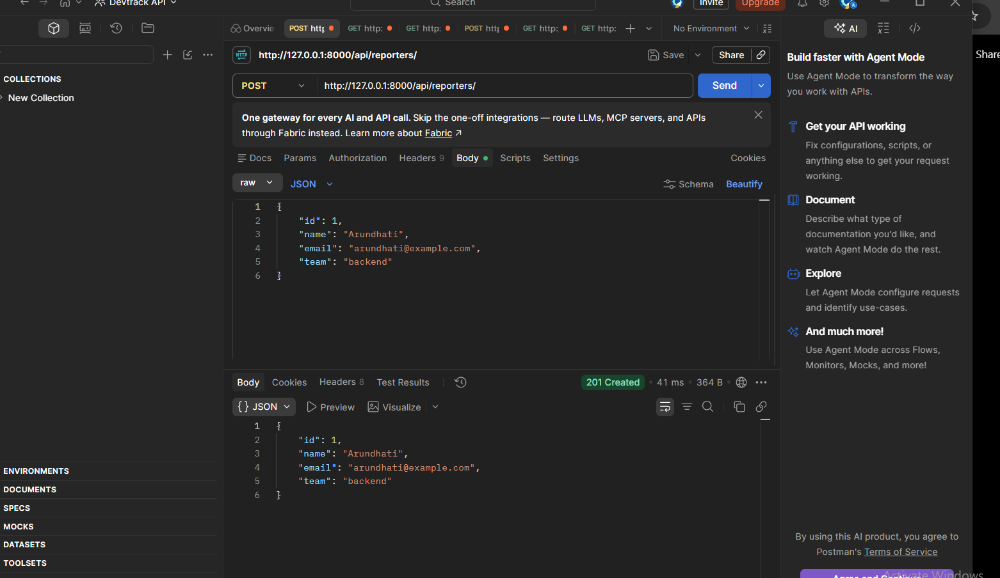
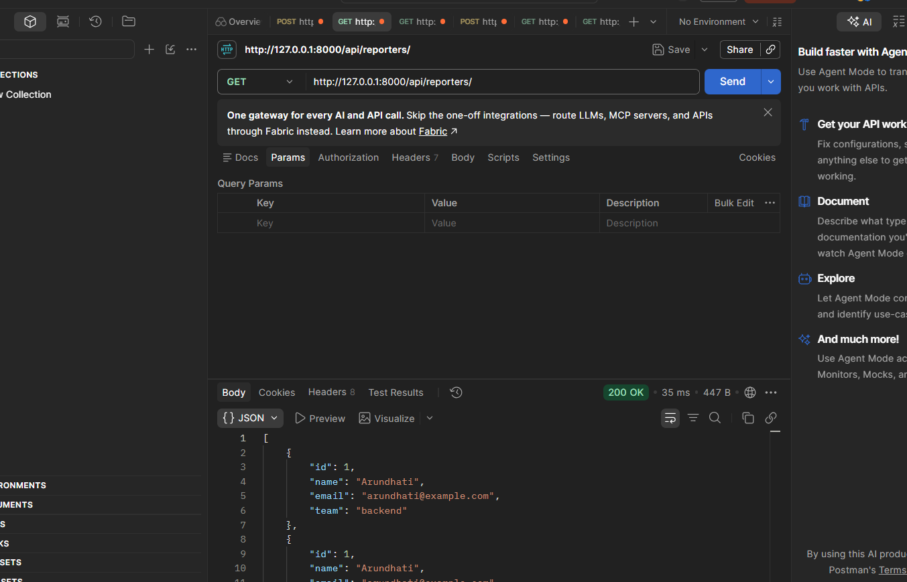
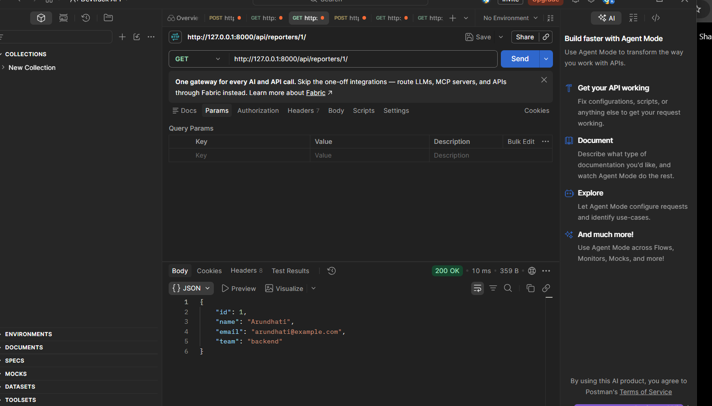
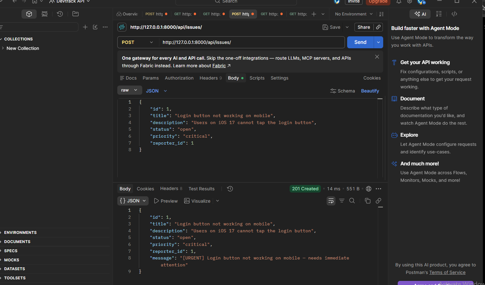
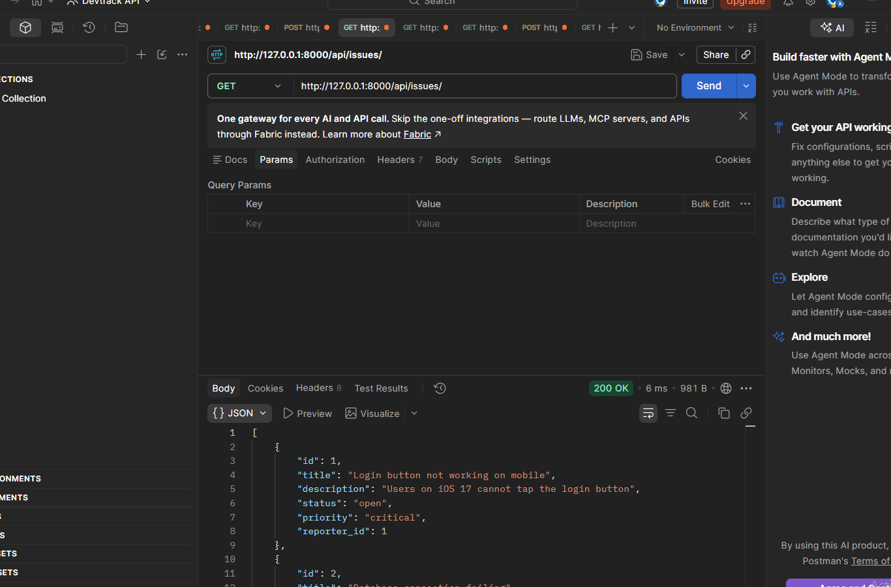
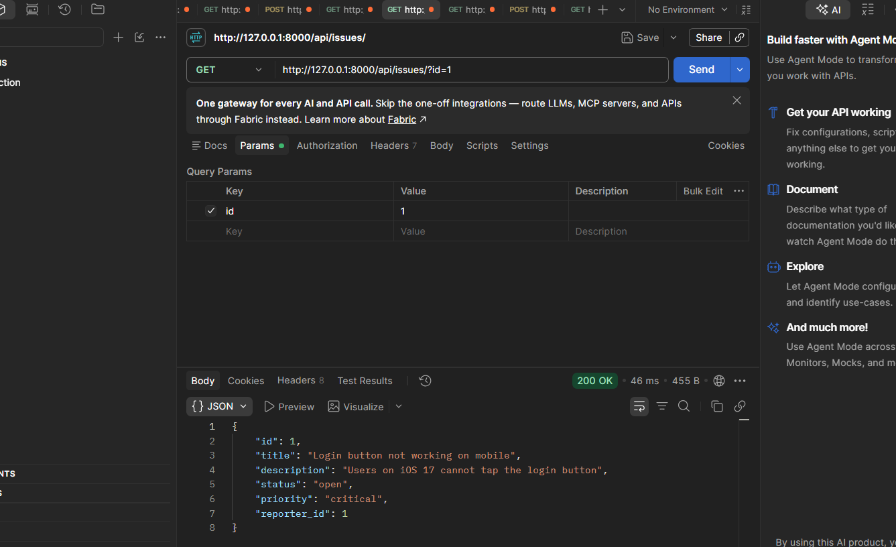
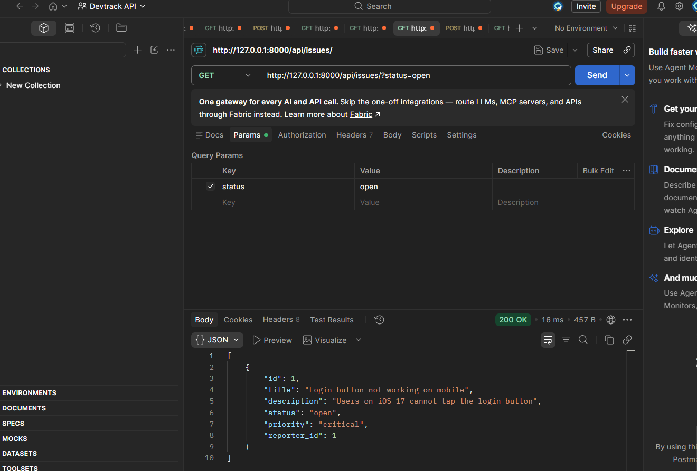

# DevTrack

DevTrack is a Django-based backend API for tracking engineering issues and reporters. It provides REST-style endpoints for creating, retrieving, updating, and deleting reporters, as well as creating and querying engineering issues.

The project uses JSON files for data persistence and demonstrates object-oriented programming concepts such as abstraction, inheritance, and method overriding.

---

## Features

- Reporter management
- Issue management
- JSON-based data storage
- Input validation
- Issue filtering by ID and status
- Object-oriented entity design
- Critical and low-priority issue subclasses
- REST-style API endpoints
- HTTP status code handling

---

## Technologies Used

- Python
- Django
- JSON
- Postman
- Git & GitHub

---

## Project Structure

```text
Devtrack/
│
├── manage.py
├── reporters.json
├── issues.json
├── README.md
│
├── devtrack/
│   ├── settings.py
│   └── urls.py
│
└── issues/
    ├── models.py
    ├── views.py
    └── urls.py
```

---

## Setup Instructions

### 1. Clone the repository

Clone the repository from GitHub:

```bash
git clone https://github.com/ArundhatiKulkarni/Devtrack.git
```

### 2. Open the project

Move into the project directory:

```bash
cd Devtrack
```

### 3. Create a virtual environment

Create a Python virtual environment:

```bash
python -m venv venv
```

### 4. Activate the virtual environment

On Windows PowerShell:

```bash
venv\Scripts\activate
```

After activation, the terminal should show:

```text
(venv) PS C:\...\Devtrack>
```

### 5. Install Django

Install Django inside the virtual environment:

```bash
pip install django
```

### 6. Check the Django project

Run:

```bash
python manage.py check
```

The expected output is:

```text
System check identified no issues (0 silenced).
```

### 7. Run the development server

Start the Django development server:

```bash
python manage.py runserver
```

The API will be available at:

```text
http://127.0.0.1:8000/
```

The API endpoints can then be tested using Postman.

---

## API Endpoints

### Reporter Endpoints

| Method | Endpoint | Description |
|--------|----------|-------------|
| POST | `/api/reporters/` | Create a new reporter |
| GET | `/api/reporters/` | Get all reporters |
| GET | `/api/reporters/<id>/` | Get a reporter by ID |
| PUT | `/api/reporters/<id>/` | Update a reporter |
| DELETE | `/api/reporters/<id>/` | Delete a reporter |

### Issue Endpoints

| Method | Endpoint | Description |
|--------|----------|-------------|
| POST | `/api/issues/` | Create a new issue |
| GET | `/api/issues/` | Get all issues |
| GET | `/api/issues/?id=1` | Get an issue by ID |
| GET | `/api/issues/?status=open` | Filter issues by status |

---

## Issue Priorities

Issues support four priority levels:

- `low`
- `medium`
- `high`
- `critical`

Critical issues are created using the `CriticalIssue` subclass, while low-priority issues are created using the `LowPriorityIssue` subclass.

The `describe()` method is overridden in both subclasses to provide different messages.

For example:

```text
[URGENT] Login button not working on mobile — needs immediate attention
```

---

## Validation

The API validates incoming data before storing it.

### Reporter Validation

- Name cannot be empty.
- Email must contain `@`.

### Issue Validation

- Title cannot be empty.
- Status must be one of:
  - `open`
  - `in_progress`
  - `resolved`
  - `closed`
- Priority must be one of:
  - `low`
  - `medium`
  - `high`
  - `critical`

Invalid requests return an HTTP `400 Bad Request` response.

---

## Object-Oriented Design

The project demonstrates several object-oriented programming concepts.

### BaseEntity

`BaseEntity` is an abstract base class that defines the `validate()` method and provides a common `to_dict()` method.

### Reporter

`Reporter` inherits from `BaseEntity` and validates the reporter's name and email.

### Issue

`Issue` inherits from `BaseEntity` and validates the issue title, status, and priority.

### CriticalIssue

`CriticalIssue` inherits from `Issue` and overrides the `describe()` method to indicate that immediate attention is required.

### LowPriorityIssue

`LowPriorityIssue` inherits from `Issue` and overrides the `describe()` method for low-priority issues.

---

## Design Decision

JSON files were used for data persistence instead of a database because the assignment requires JSON-based storage.

This approach keeps the implementation simple while demonstrating file handling, validation, object-oriented programming, inheritance, method overriding, and REST-style API development.

---

## Postman Testing

The API was tested using Postman.

### Reporter APIs

- POST `/api/reporters/`
- GET `/api/reporters/`
- GET `/api/reporters/<id>/`
- PUT `/api/reporters/<id>/`
- DELETE `/api/reporters/<id>/`

### Issue APIs

- POST `/api/issues/`
- GET `/api/issues/`
- GET `/api/issues/?id=1`
- GET `/api/issues/?status=open`

### Validation Tests

The following invalid requests were also tested:

- Invalid issue status
- Invalid issue priority
- Empty issue title
- Missing `reporter_id`

The API correctly returned `400 Bad Request` for invalid input.

---

## Postman Screenshots

Screenshots of the successful API requests and validation tests are included below.

### Reporter API Tests

Add screenshots here for:

- POST Reporter
- GET All Reporters
- GET Reporter by ID
- PUT Reporter
- DELETE Reporter

### Issue API Tests

Add screenshots here for:

- POST Issue
- GET All Issues
- GET Issue by ID
- GET Issues by Status

### Validation Tests

Add screenshots here for:

- Invalid status → `400 Bad Request`
- Invalid priority → `400 Bad Request`
- Empty title → `400 Bad Request`
- Missing `reporter_id` → `400 Bad Request`

---

## Repository

GitHub Repository:

https://github.com/ArundhatiKulkarni/Devtrack


---

## Postman Screenshots

### Reporter APIs

#### Create Reporter


#### Get All Reporters


#### Get Reporter by ID


### Issue APIs

#### Create Critical Issue


#### Get All Issues


#### Get Issue by ID


#### Filter Issues by Status
